# 02 — Arquitectura del Módulo PLD
**Diseño Técnico Completo — Sistema de Cumplimiento LFPIORPI**
**Versión:** 2.0 | **Fecha:** 2026-06-29 | **Estado:** BORRADOR — pendiente aprobación

---

## Tabla de Contenidos

1. [Principios Arquitectónicos](#1-principios-arquitectónicos)
2. [Arquitectura Lógica](#2-arquitectura-lógica)
3. [Arquitectura Física](#3-arquitectura-física)
4. [Diagrama de Componentes](#4-diagrama-de-componentes)
5. [Dependencias](#5-dependencias)
6. [Modelo de Dominio (DDD)](#6-modelo-de-dominio-ddd)
7. [Flujo End-to-End: Escritura → Acuse SAT](#7-flujo-end-to-end-escritura--acuse-sat)
8. [Integración con el Sistema Actual](#8-integración-con-el-sistema-actual)
9. [Motor de Reglas](#9-motor-de-reglas)
10. [Integración con OCR](#10-integración-con-ocr)
11. [Integración con IA](#11-integración-con-ia)
12. [Integración con SAT](#12-integración-con-sat)
13. [Auditoría y Trazabilidad](#13-auditoría-y-trazabilidad)
14. [Seguridad](#14-seguridad)
15. [Observabilidad](#15-observabilidad)
16. [Estrategia de Despliegue](#16-estrategia-de-despliegue)
17. [Estructura de Carpetas](#17-estructura-de-carpetas)
18. [API REST — Catálogo de Rutas](#18-api-rest--catálogo-de-rutas)
19. [Eventos Socket.io](#19-eventos-socketio)
20. [Preguntas Pendientes](#20-preguntas-pendientes)

---

## 1. Principios Arquitectónicos

| # | Principio | Implicación |
|---|---|---|
| P1 | **No romper lo existente** | Cero cambios de comportamiento en rutas y modelos actuales |
| P2 | **Módulo aislado** | Todo código PLD en subcarpetas `/pld/` — no se mezcla con módulos actuales |
| P3 | **Hooks, no intrusión** | El módulo se engancha post-save mediante middleware; no modifica rutas existentes |
| P4 | **Degradación elegante** | Si PLD falla, el sistema notarial continúa operando |
| P5 | **Audit log inalterable** | Registros PLD sin DELETE; solo cambios de estatus con trazabilidad |
| P6 | **Configuración > código** | Umbrales, reglas y catálogos en BD; editables sin redespliegue |
| P7 | **Separación SPPLD / DeclaraNot** | Dos flujos completamente independientes aunque nazcan de la misma escritura |
| P8 | **Consentimiento explícito** | Ninguna transmisión al SAT es automática; siempre requiere acción humana |

---

## 2. Arquitectura Lógica

### 2.1 Diagrama de Capas

```mermaid
graph TD
    subgraph PRESENTACION["Capa de Presentación (React 19 + MUI 7)"]
        E[Escrituras.jsx<br/>badge PLD + botón expediente]
        D[PLDDashboard.jsx<br/>semáforo + vencimientos]
        EX[ExpedientePLD.jsx<br/>stepper de captura]
        LA[ListaAvisos.jsx<br/>historial de avisos]
        CF[ConfigPLD.jsx<br/>reglas + UMA — solo ADMIN]
    end

    subgraph API["Capa API (Express 5 — /api/pld)"]
        R1[/expedientes]
        R2[/avisos]
        R3[/beneficiarios]
        R4[/acuses]
        R5[/dashboard]
        R6[/config]
        R7[/listas]
    end

    subgraph SERVICIOS["Capa de Servicios PLD"]
        RE[reglasEngine.js<br/>evaluación de obligaciones]
        ES[expedienteService.js<br/>ciclo de vida del expediente]
        AV[avisoService.js<br/>orquestador de aviso]
        GX[generadorXML.js<br/>fep.xsd]
        GT[generadorTXT.js<br/>DeclaraNot pipe]
        LS[listaService.js<br/>PEP + OFAC + ONU]
        US[umaService.js<br/>valor UMA vigente]
        AC[acumulacionService.js<br/>ventana 6 meses]
    end

    subgraph INFRA["Capa de Infraestructura"]
        MW[pldHook.js<br/>middleware post-escritura]
        JB[Jobs scheduler<br/>node-schedule]
        SK[Socket.io<br/>alertas tiempo real]
        FS[Filesystem<br/>storage/pld/]
    end

    subgraph DATOS["Capa de Datos (MongoDB)"]
        DB1[(pld_expedientes)]
        DB2[(pld_avisos)]
        DB3[(pld_beneficiarios)]
        DB4[(pld_acuses)]
        DB5[(pld_reglas)]
        DB6[(pld_config)]
        DB7[(pld_listas_vigilancia)]
        DB8[(pld_acumulacion)]
    end

    PRESENTACION --> API
    API --> SERVICIOS
    SERVICIOS --> INFRA
    SERVICIOS --> DATOS
    INFRA --> DATOS
```

### 2.2 Contextos Delimitados (Bounded Contexts)

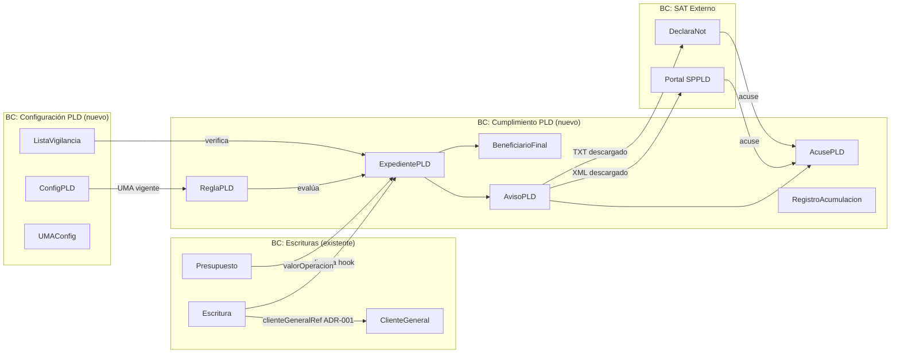

---

## 3. Arquitectura Física

### 3.1 Topología de Despliegue

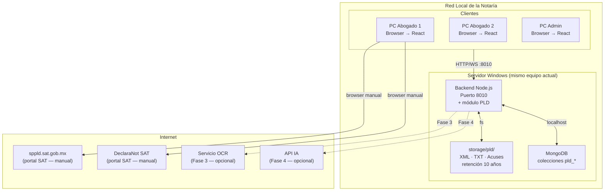

### 3.2 Consideraciones de Infraestructura

| Componente | Actual | Requerimiento PLD | Cambio necesario |
|---|---|---|---|
| Servidor | Windows 10 (suposición) | Mismo | Ninguno |
| Node.js | Existente (Express 5) | Mismo proceso | Agregar rutas y servicios |
| MongoDB | Instancia actual | Nuevas colecciones pld_* | Ningún cambio al motor |
| Disco | No documentado | +50MB/año para storage/pld/ | Verificar espacio disponible |
| Red | LAN local | Mismo | Ninguno |
| Internet | Para SAT | Manual (browser) | Ninguno — proceso humano |

---

## 4. Diagrama de Componentes

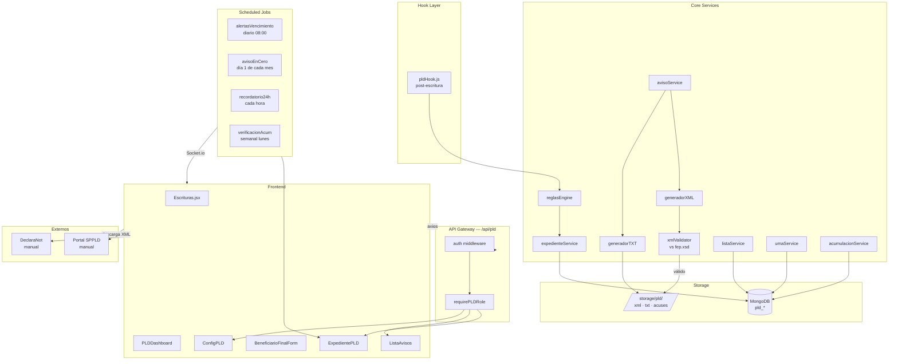

---

## 5. Dependencias

### 5.1 Dependencias de Producción (nuevas)

| Paquete | Versión recomendada | Uso |
|---|---|---|
| `node-schedule` | ^2.1 | Jobs programados (alertas, aviso en cero) |
| `libxmljs2` | ^0.31 | Validación XML contra fep.xsd |
| `xml2js` | ^0.6 | Construcción del XML SPPLD |
| `csv-parse` | ^5.5 | Importación de listas PEP en CSV |
| `archiver` | ^7.0 | Empaquetado de expediente para descarga (ZIP) |

### 5.2 Dependencias ya instaladas (reutilizar)

| Paquete | Uso en PLD |
|---|---|
| `mongoose` | Todos los modelos pld_* |
| `express` | Router /api/pld |
| `socket.io` | Alertas en tiempo real |
| `jsonwebtoken` | Auth de rutas PLD |
| `multer` | Upload de acuses (PDF) |
| `exceljs` | Reporte de auditoría exportable |

### 5.3 Dependencias de Desarrollo (nuevas)

| Paquete | Uso |
|---|---|
| `jest` + `supertest` | Tests unitarios de reglasEngine y generadores |
| `mongodb-memory-server` | Tests de servicios sin BD real |

### 5.4 Mapa de Dependencias entre Servicios

```
reglasEngine      ← depende de: umaService, pld_reglas, pld_config
expedienteService ← depende de: reglasEngine, listaService, acumulacionService
avisoService      ← depende de: expedienteService, generadorXML, generadorTXT
generadorXML      ← depende de: xmlValidator (fep.xsd), ClienteGeneral, BeneficiarioFinal
generadorTXT      ← depende de: Escritura, Presupuesto
listaService      ← depende de: pld_listas_vigilancia
acumulacionService← depende de: pld_acumulacion, pld_expedientes
umaService        ← depende de: pld_config
```

---

## 6. Modelo de Dominio (DDD)

### 6.1 Entidades y Agregados

```
AGREGADO: ExpedientePLD  (raíz de agregado)
├── Entidad: BeneficiarioFinal (1..N por expediente)
├── Value Object: DatosIdentificacion { tipo, numero, vigencia, emisor }
├── Value Object: VerificacionPEP { resultado, fechaVerif, listaConsultada }
├── Value Object: FormaPago { tipo, monto, moneda }
└── Value Object: EvaluacionMotor { tipoActividad, montoUMA, obligacion, justificacion }

AGREGADO: AvisoPLD  (raíz de agregado)
├── Entidad: AcusePLD (0..1 por aviso)
├── Value Object: PeriodoReporte { año, mes }
├── Value Object: ArchivoGenerado { tipo: XML|TXT, ruta, hash, fechaGeneracion }
└── Value Object: FolioSAT { folio, fechaTransmision }

ENTIDAD DE SOPORTE: ReglaPLD
├── Value Objects: Condicion { campo, operador, valor }
└── Value Objects: Umbral { tipoActividad, valorUMA, tieneUmbral }

ENTIDAD DE SOPORTE: RegistroAcumulacion
└── Value Object: VentanaAcumulacion { clienteId, montoTotal, operaciones[], inicio, fin }
```

### 6.2 Diagrama de Entidades

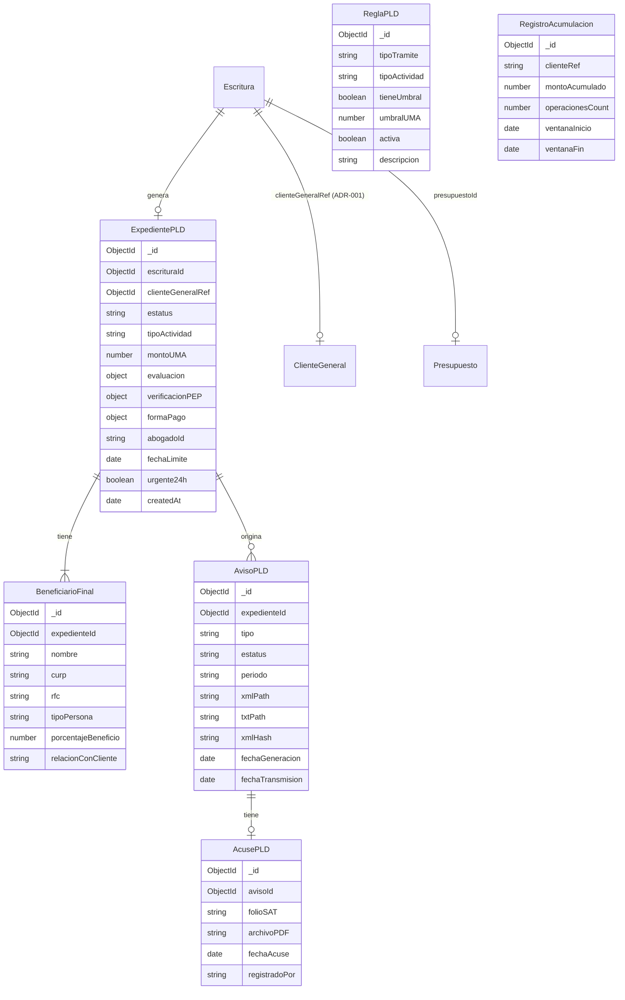

### 6.3 Estados del ExpedientePLD

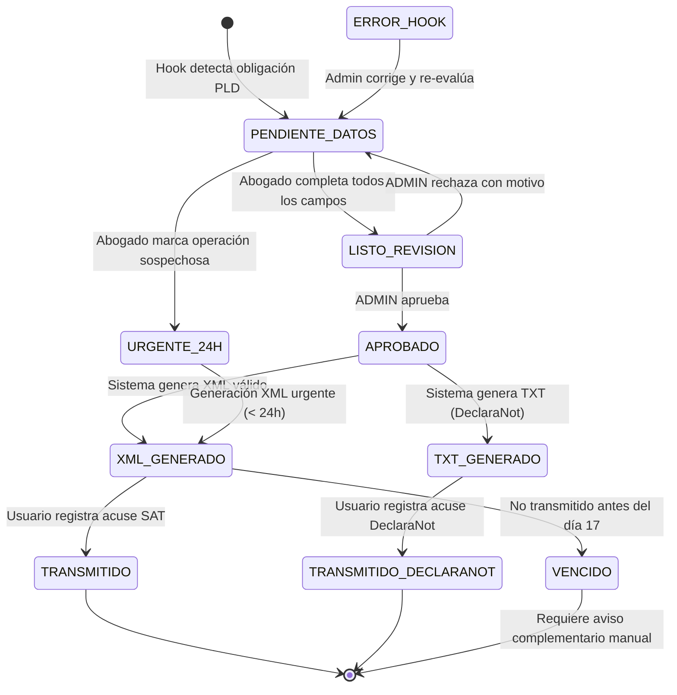

### 6.4 Estados del AvisoPLD

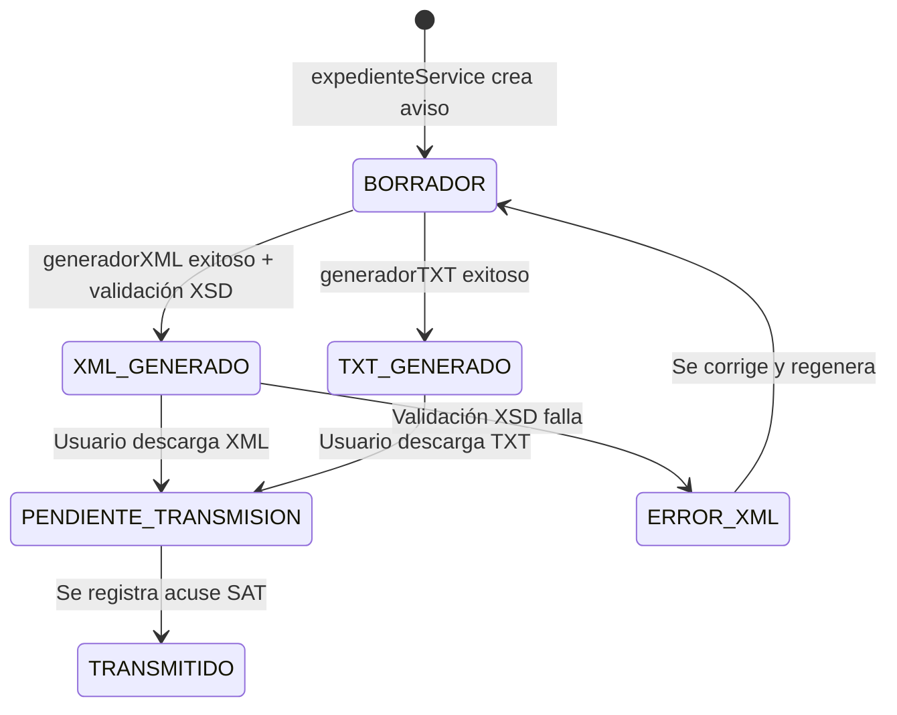

---

## 7. Flujo End-to-End: Escritura → Acuse SAT

### 7.1 Flujo SPPLD (Aviso Regular)

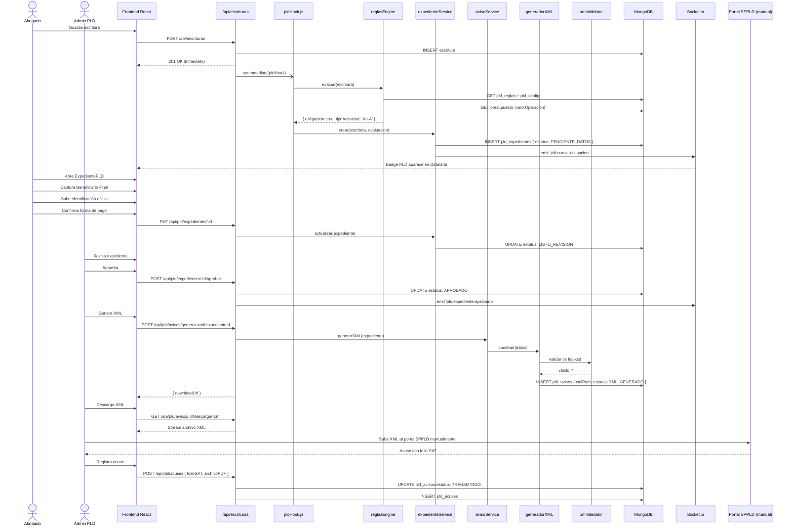

### 7.2 Flujo Aviso Urgente 24 Horas (Art. 7 Bis)

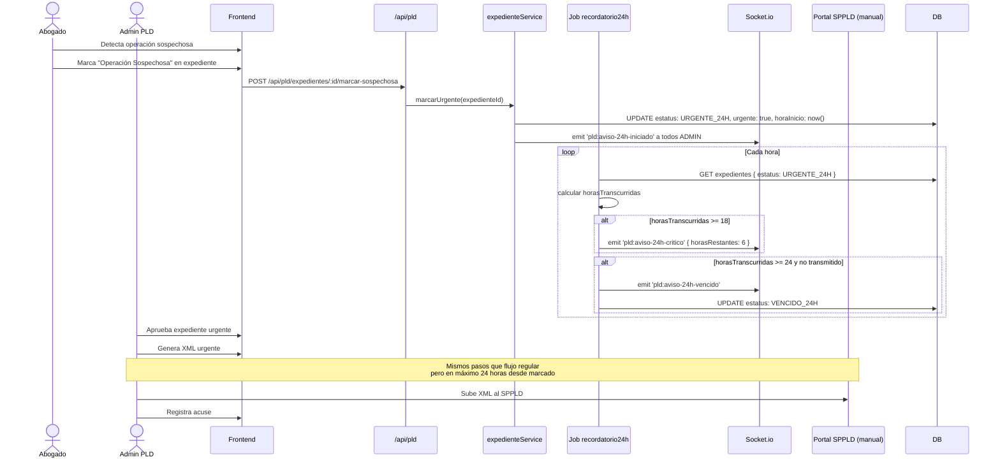

### 7.3 Flujo DeclaraNot (paralelo e independiente)

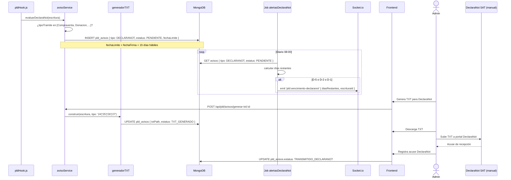

---

## 8. Integración con el Sistema Actual

### 8.1 Contrato de Integración con Escrituras

El único punto de integración es el hook post-save. El hook es **no bloqueante**:

```
POST /api/escrituras → guarda escritura → responde 201
                                        ↓ (asíncrono, sin await)
                                   pldHook(escritura)
                                        ↓
                                   reglasEngine.evaluar()
                                        ↓
                                   si obligacion → crear ExpedientePLD
```

Campos que el hook **lee** de Escritura (solo lectura):

```
escritura.tipoTramite          → para evaluar actividad vulnerable
escritura.fecha                → para calcular fecha límite día 17
escritura.abogado              → para asignar expediente y alertas
escritura.clienteGeneralRef    → para KYC automático (ADR-001)
escritura.cliente              → fallback si clienteGeneralRef = null
escritura.presupuestoId        → para recuperar valorOperacion
escritura.valorAvaluo          → fallback si no hay presupuesto
escritura.numeroControl        → identificador humano del expediente PLD
```

Campos que el hook **nunca modifica** en Escritura: ninguno.

### 8.2 Badge PLD en Escrituras.jsx

El único cambio visible en la UI existente:

```
DataGrid de Escrituras
┌─────┬───────────────┬────────────┬──────────┬─────────────────┐
│ Núm │ Tipo Trámite  │ Cliente    │ Fecha    │ PLD             │
├─────┼───────────────┼────────────┼──────────┼─────────────────┤
│ 104 │ Compraventa   │ J. Pérez   │ 20-jun   │ 🔴 PENDIENTE   │
│ 103 │ Donación      │ A. López   │ 18-jun   │ 🟢 TRANSMITIDO │
│ 102 │ Ratificación  │ M. García  │ 15-jun   │ — N/A           │
└─────┴───────────────┴────────────┴──────────┴─────────────────┘
```

- Badge carga lazy (solo filas visibles): `GET /api/pld/expedientes/escritura/:id`
- Clic en badge → abre `ExpedientePLD` como `<Dialog>` MUI
- Escrituras sin obligación PLD muestran "—"

### 8.3 Integración con ClienteGeneral

```
Cuando clienteGeneralRef está poblado (ADR-001):

generadorXML usa directamente:
  clienteGeneral.nombre_completo  → Nombre del cliente en XML
  clienteGeneral.curp             → CURP en XML
  clienteGeneral.rfc              → RFC en XML
  clienteGeneral.fecha_nacimiento → Fecha nacimiento en XML
  clienteGeneral.domicilio        → Domicilio en XML
  clienteGeneral.colonia          → Colonia en XML
  clienteGeneral.lugar_nacimiento → Lugar nacimiento en XML
  clienteGeneral.ocupacion        → Ocupación en XML
  clienteGeneral.estado_civil     → Estado civil en XML

Cuando clienteGeneralRef = null (escritura histórica):
  El expediente PLD carga con campos vacíos.
  El abogado los captura manualmente en el formulario del expediente.
  El XML no se puede generar hasta que los campos obligatorios estén completos.
```

### 8.4 Integración con Presupuesto

```
pldHook → presupuestos.findOne({ _id: escritura.presupuestoId })
        → usa presupuesto.valorOperacion para comparar con umbral UMA

Fallback 1: si presupuestoId = null → usa escritura.valorAvaluo
Fallback 2: si valorAvaluo = null → marca expediente DATOS_INCOMPLETOS (sin monto)
            el abogado captura el monto manualmente en el expediente PLD
```

### 8.5 Sidebar en MainPage.jsx

Se agrega una sección "PLD / Antilavado" en el sidebar con acceso controlado por rol:

```
Sidebar
├── Escrituras              (existente)
├── Protocolito             (existente)
├── Recibos                 (existente)
├── Clientes Generales      (existente)
├── Presupuestos            (existente)
├── ─────────────────────
└── PLD / Antilavado        (NUEVO — visible: ADMIN, ABOGADO)
    ├── Dashboard
    ├── Expedientes PLD
    ├── Historial de Avisos
    └── Configuración       (solo ADMIN)
```

---

## 9. Motor de Reglas

### 9.1 Arquitectura del Motor

El motor de reglas es el componente más crítico del módulo. Lee las reglas desde MongoDB (`pld_reglas`) para ser configurable sin redespliegue.

```mermaid
graph TD
    INPUT[Escritura + Presupuesto]
    --> STEP1[1. Normalizar tipoTramite]
    --> STEP2[2. Buscar regla activa en pld_reglas]
    --> STEP3{¿Regla encontrada?}

    STEP3 -->|No| NOOP[No genera obligación PLD]
    STEP3 -->|Sí| STEP4{¿tieneUmbral?}

    STEP4 -->|No| OBLIGACION[Genera obligación\nsin importar monto]
    STEP4 -->|Sí| STEP5[3. Obtener UMA vigente de pld_config]
    STEP5 --> STEP6[4. valorOperacion / UMA = umaMonto]
    STEP6 --> STEP7{umaMonto > umbralUMA?}

    STEP7 -->|No| ACUM[5. Verificar acumulación\n6 meses rolling]
    STEP7 -->|Sí| OBLIGACION

    ACUM --> STEP8{acumulado 6m > umbralUMA?}
    STEP8 -->|No| NOOP
    STEP8 -->|Sí| OBLIG_ACUM[Genera obligación\npor acumulación]

    OBLIGACION --> RESULT[EvaluacionMotor\n{ obligacion, tipoActividad,\n  montoUMA, justificacion }]
    OBLIG_ACUM --> RESULT
```

### 9.2 Schema de ReglaPLD

```
pld_reglas {
  _id: ObjectId,
  tipoTramite: String,           // "Compraventa", "Donacion", etc.
  tipoActividad: String,         // "XII-A", "XII-B", "XII-C", "XII-D", "XII-E"
  descripcion: String,           // texto legible de la actividad vulnerable
  tieneUmbral: Boolean,          // false = siempre aviso
  umbralUMA: Number,             // 8000 para XII-A, 4000 para XII-B, 0 si sin umbral
  activa: Boolean,               // permite desactivar sin eliminar
  version: Number,               // para trazabilidad de cambios
  creadoPor: String,
  createdAt: Date,
  updatedAt: Date
}
```

### 9.3 Reglas Iniciales (datos semilla)

| tipoTramite | tipoActividad | tieneUmbral | umbralUMA |
|---|---|---|---|
| Compraventa | XII-A | true | 8,000 |
| Donacion | XII-A | true | 8,000 |
| Adjudicacion | XII-A | true | 8,000 |
| Garantia Hipotecaria | XII-A | true | 8,000 |
| Fideicomiso Traslativo | XII-B | true | 4,000 |
| Poder Irrevocable | XII-C | false | 0 |
| Constitucion Persona Moral | XII-D | false | 0 |
| Fusion Escision | XII-D | false | 0 |
| Protocolizacion | XII-D | false | 0 |
| Credito Prestamo | XII-E | false | 0 |

### 9.4 Acumulación Rolling 6 Meses

```
Por cada operación nueva de un cliente:
  1. Buscar RegistroAcumulacion { clienteRef, activo: true }
  2. Sumar montoOperacion al acumulado
  3. Si ventanaInicio tiene más de 6 meses: resetear ventana
  4. Si acumulado > umbral correspondiente:
     → generar ExpedientePLD con justificacion: "ACUMULACION_6_MESES"
     → alerta al ADMIN
```

---

## 10. Integración con OCR

> **Fase 3 — No se implementa en fases 1 y 2**

### 10.1 Objetivo

Automatizar la captura de datos de identificaciones oficiales (INE, pasaporte) subidas como imagen en el expediente PLD, eliminando la captura manual.

### 10.2 Arquitectura propuesta

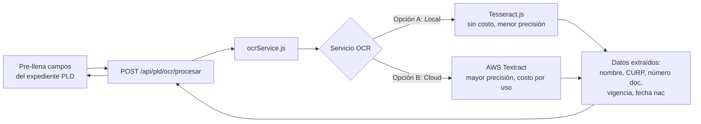

### 10.3 Campos objetivo a extraer

| Documento | Campos extraíbles |
|---|---|
| INE (frente) | Nombre completo, CURP, fecha nacimiento, clave de elector, vigencia |
| INE (reverso) | Domicilio, sección electoral |
| Pasaporte | Nombre, fecha nacimiento, número de pasaporte, vigencia, nacionalidad |
| RFC físico | RFC, nombre, código postal fiscal |

### 10.4 Decisiones pendientes para Fase 3

- ¿Tesseract local (gratuito, instalar en servidor) o AWS Textract (pago por imagen)?
- ¿Se almacena la imagen original? Implicaciones de privacidad y LFPD.
- ¿Se muestra al usuario para corrección antes de guardar? (siempre sí — el OCR no es perfecto)

---

## 11. Integración con IA

> **Fase 4 — No se implementa en fases 1, 2 y 3**

### 11.1 Casos de uso potenciales

| Caso | Descripción | Complejidad |
|---|---|---|
| Perfil de riesgo | Calcula score de riesgo por cliente basado en historial y sector | Alta |
| Detección de patrones | Identifica operaciones inusuales por monto, frecuencia o contraparte | Alta |
| Sugerencia de BF | Sugiere quién podría ser el Beneficiario Final según el tipo de operación | Media |
| Alertas de acumulación inteligente | Detecta acumulación indirecta (clientes relacionados) | Muy alta |

### 11.2 Arquitectura propuesta (Fase 4)

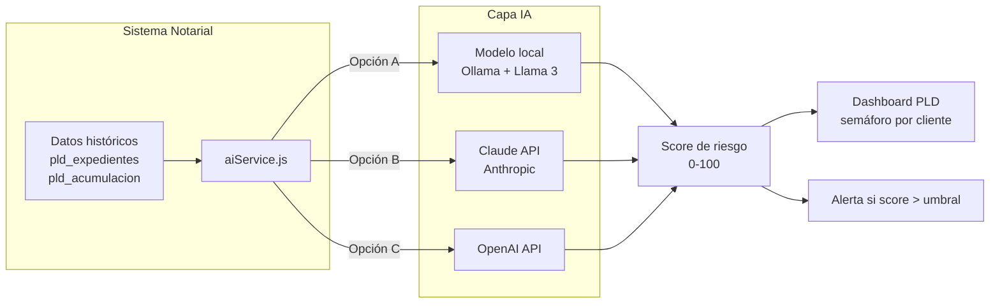

### 11.3 Consideraciones de privacidad

Los datos enviados a una API de IA externa (nombres, RFC, CURP) son datos personales protegidos por la LFPD. Si se adopta una API cloud en Fase 4, se requiere:
- Revisión legal de los términos de uso del proveedor
- Posible anonimización antes de enviar
- Evaluación de impacto en privacidad (PIA)

La opción de modelo local (Ollama) evita estas implicaciones.

---

## 12. Integración con SAT

### 12.1 Mapa de Sistemas SAT

```
SISTEMA NOTARIAL
      │
      ├──→ SPPLD (sppld.sat.gob.mx)
      │        Formato: XML firmado con e.firma (XMLDSig)
      │        Esquema: fep.xsd
      │        Proceso: MANUAL — usuario descarga XML, lo firma en browser, lo sube
      │        Plazo: día 17 del mes siguiente (o siguiente día hábil)
      │        Tipo: Obligación LFPIORPI (anti-lavado)
      │
      └──→ DeclaraNot (portal SAT)
               Formato: TXT pipe-delimited | UTF-8 | CRLF
               Tipos: 24 (venta) | 25 (adquisición) | 26 (corporativo) | 27 (socios)
               Proceso: MANUAL — usuario descarga TXT, lo sube al portal
               Plazo: 15 días hábiles desde fecha de firma
               Tipo: Obligación CFF Art. 27 (fiscal — distinto régimen)
```

### 12.2 Proceso de Firma e.firma (SPPLD)

El sistema **NO maneja** la e.firma directamente. El proceso es:

```
Sistema genera XML válido (fep.xsd)
    ↓
Usuario descarga XML desde el sistema
    ↓
Usuario accede a sppld.sat.gob.mx en su navegador
    ↓
Portal solicita e.firma (.cer + .key + contraseña)
    ↓
Portal firma el XML con XMLDSig
    ↓
Portal recibe y procesa el aviso
    ↓
Portal emite acuse con folio SAT
    ↓
Usuario descarga acuse (PDF)
    ↓
Usuario registra el folio y sube el PDF al sistema
```

### 12.3 Estructura del XML fep.xsd (resumen)

```xml
<Avisos>
  <Aviso>
    <DatosGenerales
      FolioInterno="ESC-14004"
      FechaOperacion="2026-06-20"
      Instrumento="Escritura"
      NumeroInstrumento="14004"
    />
    <ActividadVulnerable
      Fraccion="XII-A"
      Descripcion="Transmision de derechos reales sobre inmuebles"
      MontoOperacion="1500000.00"
      Moneda="MXN"
      TipoCambio="1"
    />
    <DatosCliente
      TipoPersona="FISICA"
      Nombre="JUAN"
      ApellidoPaterno="PEREZ"
      ApellidoMaterno="GARCIA"
      FechaNacimiento="1980-05-15"
      CURP="PEGJ800515HCHRZN09"
      RFC="PEGJ800515AB1"
      Nacionalidad="MX"
    />
    <Domicilio
      Calle="Av. Juárez"
      NumeroExterior="100"
      Colonia="Centro"
      Municipio="Juárez"
      Estado="CHI"
      CodigoPostal="32000"
      Pais="MX"
    />
    <BeneficiarioFinal ... />
    <FormaPago Tipo="TRANSFERENCIA" Monto="1500000.00" />
  </Aviso>
</Avisos>
```

> El schema `fep.xsd` completo debe descargarse del portal SPPLD y guardarse en
> `Backend/services/pld/schemas/fep.xsd` para la validación local.

### 12.4 Formato TXT DeclaraNot (resumen)

```
Tipo 24 (venta):
CAMPO1|CAMPO2|RFC_VENDEDOR|NOMBRE_VENDEDOR|CURP|...|MONTO|FECHA_FIRMA|FECHA_PROTOCOLO

Separador: pipe (|)
Codificación: UTF-8
Fin de línea: CRLF (\r\n)
Sin encabezado de columnas
Un registro por operación
```

---

## 13. Auditoría y Trazabilidad

### 13.1 Principios de Auditoría

- **Inmutabilidad:** Ningún registro PLD se elimina. Solo cambian de estatus.
- **Actor:** Cada cambio registra `{ quien, cuando, accion, valorAnterior, valorNuevo }`.
- **Completitud:** El audit log cubre expedientes, avisos, acuses y cambios de configuración.
- **Retención:** 10 años conforme LFPIORPI Art. 18-bis (reforma jul/2025).

### 13.2 Colección pld_audit_log

```
pld_audit_log {
  _id: ObjectId,
  entidad: String,        // 'ExpedientePLD' | 'AvisoPLD' | 'ReglaPLD' | 'ConfigPLD'
  entidadId: ObjectId,
  accion: String,         // 'CREAR' | 'ACTUALIZAR' | 'APROBAR' | 'RECHAZAR' | 'GENERAR_XML' | ...
  actor: String,          // nombre del abogado/admin
  actorId: String,
  valorAnterior: Object,  // snapshot del objeto antes del cambio
  valorNuevo: Object,     // snapshot del objeto después del cambio
  ip: String,
  userAgent: String,
  timestamp: Date
}
```

### 13.3 Reporte de Auditoría Anual

La LFPIORPI (Art. 18-quater, reforma 2025) exige auditoría anual documentada.
El sistema genera un reporte exportable (Excel/PDF) con:

```
Período: Enero–Diciembre {año}

1. Resumen ejecutivo
   - Total operaciones revisadas
   - Total avisos transmitidos al SPPLD
   - Total avisos en cero
   - Avisos urgentes 24h
   - Avisos pendientes de transmisión
   - Operaciones rechazadas / sospechosas

2. Detalle por mes (tabla)
   - Mes | # Escrituras | # Con obligación PLD | # Transmitidos | Estatus

3. Clientes con mayor actividad (acumulación)

4. Verificaciones PEP realizadas

5. Cambios de configuración del motor de reglas

6. Incidencias y resoluciones

7. Firma del Oficial de Cumplimiento (campo manual)
```

---

## 14. Seguridad

### 14.1 Autenticación y Autorización

```
Todas las rutas /api/pld/ requieren:
  1. JWT válido (middleware auth.js existente)
  2. rol en ['ADMIN', 'ABOGADO'] (requirePLDRole)
  3. Para acciones críticas (aprobar, generar XML, config): rol = 'ADMIN'
```

### 14.2 Protección de Datos Personales (LFPD)

Los datos KYC (CURP, RFC, domicilio) son datos personales protegidos:

| Medida | Implementación |
|---|---|
| Acceso mínimo necesario | ABOGADO solo ve expedientes de sus propias escrituras |
| Sin exposición en logs | Los campos CURP/RFC se excluyen de logs de error |
| Transmisión cifrada | HTTPS en producción (mismo requisito que sistema actual) |
| No envío a terceros | Los datos no salen del servidor excepto en el XML al SPPLD (proceso manual) |

### 14.3 Integridad del Audit Log

```
El audit log es append-only:
- No hay endpoint DELETE en pld_audit_log
- El middleware de auth verifica que el rol ADMIN no tenga acceso a DELETE de audit
- Los logs se marcan con hash del registro anterior (cadena de integridad)
```

### 14.4 Validación de Entradas

Todas las entradas a la API PLD se validan con `express-validator` o Mongoose schema validators antes de procesar:
- Campos obligatorios
- Formatos CURP (regex oficial SAT)
- Formatos RFC (regex oficial SAT)
- Montos positivos
- Fechas en rango válido

---

## 15. Observabilidad

### 15.1 Logging

```
Niveles:
  INFO  — expediente creado, aviso generado, acuse registrado
  WARN  — hook PLD falló (escritura guardada igualmente), campo faltante en KYC
  ERROR — validación XSD fallida, error de BD en módulo PLD

Formato: JSON estructurado
  { timestamp, level, module: 'PLD', action, escrituraId, expedienteId, message }

Destino: mismo sistema de logs del backend actual
```

### 15.2 Métricas del Dashboard

El `GET /api/pld/dashboard/resumen` expone:

```json
{
  "pendientesCaptura": 3,
  "pendientesAprobacion": 1,
  "pendientesTransmision": 2,
  "transmitidosMes": 8,
  "vencidosMes": 0,
  "urgentes24h": 0,
  "proximoVencimiento": "2026-07-17",
  "diasParaVencimiento": 18,
  "declaranotPendientes": 1,
  "ultimoAvisoEnCero": "2026-06-01"
}
```

### 15.3 Semáforo de Cumplimiento

```
🟢 VERDE   — todos los expedientes transmitidos, próximo vencimiento > 10 días
🟡 AMARILLO — expedientes pendientes, vencimiento en 5-10 días
🔴 ROJO    — expedientes vencidos O vencimiento < 5 días O urgente 24h activo
```

---

## 16. Estrategia de Despliegue

### 16.1 Fases de Despliegue

```
FASE 1 — Backend silencioso (0 cambios visibles en UI)
  □ Agregar modelos pld_* (nuevas colecciones)
  □ Agregar campo clienteGeneralRef a Escritura (ADR-001, default: null)
  □ Agregar pldHook (fire-and-forget)
  □ Agregar rutas /api/pld (sin UI todavía)
  □ Agregar reglasEngine + datos semilla de reglas
  □ Agregar jobs (desactivados inicialmente)
  Criterio de éxito: sistema actual funciona sin cambios

FASE 2 — UI básica
  □ Badge PLD en DataGrid de Escrituras
  □ ExpedientePLD stepper (captura + BF)
  □ Selector ClienteGeneral en alta de escrituras (ADR-001 Fase 2)
  □ Activar jobs de alertas
  Criterio de éxito: primer expediente PLD completado y XML generado

FASE 3 — Dashboard y reportes
  □ PLDDashboard con semáforo
  □ ListaAvisos con filtros
  □ ConfigPLD (reglas + UMA)
  □ Reporte de auditoría anual
  Criterio de éxito: reporte de auditoría generado correctamente

FASE 4 — OCR e IA (evaluación futura)
  □ Evaluar proveedor OCR
  □ Piloto con 10 identificaciones reales
  □ Si precisión > 90%: integrar al ExpedientePLD
```

### 16.2 Plan de Rollback por Fase

| Fase | Rollback | Impacto en datos |
|---|---|---|
| Fase 1 | Revertir commit | Ninguno — modelos con defaults seguros |
| Fase 2 | Revertir commit UI | Ninguno — backend sigue operando |
| Fase 3 | Revertir commit UI | Ninguno |
| ADR-001 Fase 1 | Revertir campo en schema | Ninguno — MongoDB ignora campos no mapeados |

### 16.3 Ambiente de Pruebas

Antes de cada deploy de fase se ejecutan:
```
□ Tests unitarios: reglasEngine (evaluación de umbrales UMA)
□ Tests unitarios: generadorXML (validación contra fep.xsd)
□ Tests de integración: pldHook con escritura de prueba
□ Prueba manual: generar XML de una escritura real de prueba
□ Prueba manual: cargar XML en SPPLD (ambiente de pruebas SAT si disponible)
```

---

## 17. Estructura de Carpetas

```
Backend/
├── index.js                        ← + app.use('/api/pld', pldRouter)
├── routes/
│   ├── escrituras.js               ← + pldHook al final de POST/PUT (1 línea)
│   └── pld.js                      ← NUEVO
├── models/
│   ├── Escritura.js                ← + clienteGeneralRef, clienteNombreHistorico
│   └── pld/
│       ├── ExpedientePLD.js
│       ├── BeneficiarioFinal.js
│       ├── AvisoPLD.js
│       ├── AcusePLD.js
│       ├── ReglaPLD.js
│       ├── ListaVigilancia.js
│       ├── RegistroAcumulacion.js
│       ├── ConfigPLD.js
│       └── AuditLogPLD.js
├── services/
│   └── pld/
│       ├── reglasEngine.js
│       ├── expedienteService.js
│       ├── avisoService.js
│       ├── generadorXML.js
│       ├── generadorTXT.js
│       ├── listaService.js
│       ├── umaService.js
│       └── acumulacionService.js
├── middleware/
│   └── pld/
│       ├── pldHook.js
│       └── requirePLDRole.js
├── jobs/
│   └── pld/
│       ├── alertasVencimiento.job.js
│       ├── avisoEnCero.job.js
│       ├── recordatorio24h.job.js
│       └── verificacionAcumulacion.job.js
├── utils/
│   └── pld/
│       ├── xmlValidator.js
│       ├── txtBuilder.js
│       └── normalizador.js
└── storage/
    └── pld/
        ├── xml/{año}/{mes}/
        ├── txt/{año}/{mes}/
        └── acuses/{año}/{mes}/

Frontend/src/
├── pages/
│   └── MainPage.jsx               ← + sección PLD en sidebar
└── components/
    ├── Escrituras.jsx             ← + columna badge PLD
    └── pld/
        ├── PLDDashboard.jsx
        ├── ExpedientePLD.jsx
        ├── BeneficiarioFinalForm.jsx
        ├── ListaAvisos.jsx
        ├── ConfigPLD.jsx
        └── hooks/
            └── usePLD.js
```

---

## 18. API REST — Catálogo de Rutas

Base: `/api/pld` | Auth: JWT requerido en todas.

| Método | Ruta | Descripción | Rol |
|---|---|---|---|
| GET | `/expedientes` | Lista con filtros | ABOGADO |
| GET | `/expedientes/:id` | Detalle completo | ABOGADO |
| GET | `/expedientes/escritura/:escrituraId` | Por escritura | ABOGADO |
| PUT | `/expedientes/:id` | Actualizar datos KYC | ABOGADO |
| POST | `/expedientes/:id/aprobar` | Aprobar para XML | ADMIN |
| POST | `/expedientes/:id/rechazar` | Rechazar con motivo | ADMIN |
| POST | `/expedientes/:id/marcar-sospechosa` | Flujo urgente 24h | ABOGADO |
| GET | `/beneficiarios/expediente/:id` | BF de expediente | ABOGADO |
| POST | `/beneficiarios` | Agregar BF | ABOGADO |
| PUT | `/beneficiarios/:id` | Actualizar BF | ABOGADO |
| DELETE | `/beneficiarios/:id` | Soft-delete BF | ABOGADO |
| GET | `/avisos` | Lista de avisos | ABOGADO |
| GET | `/avisos/:id` | Detalle de aviso | ABOGADO |
| POST | `/avisos/generar-xml/:expedienteId` | Genera XML SPPLD | ADMIN |
| GET | `/avisos/:id/descargar-xml` | Descarga XML | ADMIN |
| POST | `/avisos/generar-txt/:expedienteId` | Genera TXT DeclaraNot | ADMIN |
| GET | `/avisos/:id/descargar-txt` | Descarga TXT | ADMIN |
| POST | `/avisos/en-cero` | Genera aviso en cero | ADMIN |
| POST | `/acuses` | Registrar acuse SAT | ABOGADO |
| GET | `/acuses/aviso/:avisoId` | Acuse de un aviso | ABOGADO |
| GET | `/dashboard/resumen` | Contadores semáforo | ABOGADO |
| GET | `/dashboard/vencimientos` | Próximos vencimientos | ABOGADO |
| GET | `/dashboard/acumulacion/:clienteId` | Acumulación 6 meses | ABOGADO |
| GET | `/reportes/auditoria` | Reporte anual | ADMIN |
| GET | `/reportes/periodo` | Resumen por período | ADMIN |
| GET | `/config` | Config actual | ADMIN |
| PUT | `/config` | Actualizar config (UMA) | ADMIN |
| GET | `/reglas` | Lista reglas | ADMIN |
| POST | `/reglas` | Crear regla | ADMIN |
| PUT | `/reglas/:id` | Actualizar regla | ADMIN |
| DELETE | `/reglas/:id` | Desactivar regla | ADMIN |
| POST | `/listas/verificar` | Verificar en listas PEP/OFAC | ABOGADO |
| POST | `/listas/importar` | Importar lista PEP CSV | ADMIN |

---

## 19. Eventos Socket.io

| Evento | Dirección | Payload | Destinatario |
|---|---|---|---|
| `pld:nueva-obligacion` | Server→Client | `{ escrituraId, numeroControl, tipoActividad, urgente }` | Abogado titular |
| `pld:expediente-aprobado` | Server→Client | `{ expedienteId, escrituraId }` | Abogado titular |
| `pld:expediente-rechazado` | Server→Client | `{ expedienteId, motivo }` | Abogado titular |
| `pld:vencimiento-proximo` | Server→Client | `{ diasRestantes, expedientes[], tipo: 'SPPLD'|'DECLARANOT' }` | Todos ABOGADO + ADMIN |
| `pld:aviso-24h-iniciado` | Server→Client | `{ expedienteId, escrituraId, horaInicio }` | Todos ADMIN |
| `pld:aviso-24h-critico` | Server→Client | `{ expedienteId, horasRestantes }` | Todos ADMIN |
| `pld:aviso-24h-vencido` | Server→Client | `{ expedienteId }` | Todos ADMIN |
| `pld:xml-generado` | Server→Client | `{ avisoId, escrituraId }` | Abogado titular + ADMIN |
| `pld:acumulacion-alerta` | Server→Client | `{ clienteRef, montoAcumulado, umbralUMA }` | Todos ADMIN |

---

## 20. Preguntas Pendientes

| ID | Pregunta | Afecta | Urgencia |
|---|---|---|---|
| PA-01 | ¿El servidor tiene espacio suficiente para storage/pld/ (~50MB/año)? | Arquitectura física | ALTA |
| PA-02 | ¿El backend corre en Windows o Linux en producción? | Rutas filesystem (\ vs /) | ALTA |
| PA-03 | ¿La Notaría ya tiene cuenta activa en SPPLD? ¿Ha presentado avisos antes? | Plan de pruebas | ALTA |
| PA-04 | ¿Hay acceso a un ambiente de pruebas del SPPLD para validar XML? | Plan de pruebas | MEDIA |
| PA-05 | ¿node-schedule ya está instalado en el proyecto? | Dependencias Fase 1 | BAJA |
| PA-06 | ¿Existe más de un abogado titular por escritura? | Destinatario de alertas Socket.io | MEDIA |
| PA-07 | ¿El schema fep.xsd oficial está disponible para descarga en el portal SPPLD? | Validación XML | ALTA |
| PA-08 | ¿Se desea que los avisos en cero se generen automáticamente o que el ADMIN los apruebe? | Job avisoEnCero | MEDIA |
| PA-09 | ¿La Notaría tiene acceso a la lista PEP de la UIF en formato electrónico descargable? | listaService Fase 1 | ALTA |

---

*Documento preparado por el equipo de arquitectura. Versión 2.0 — 2026-06-29.*
*Siguiente documento: [03-modelo-datos.md](03-modelo-datos.md) — Schemas MongoDB completos de todas las colecciones PLD.*
